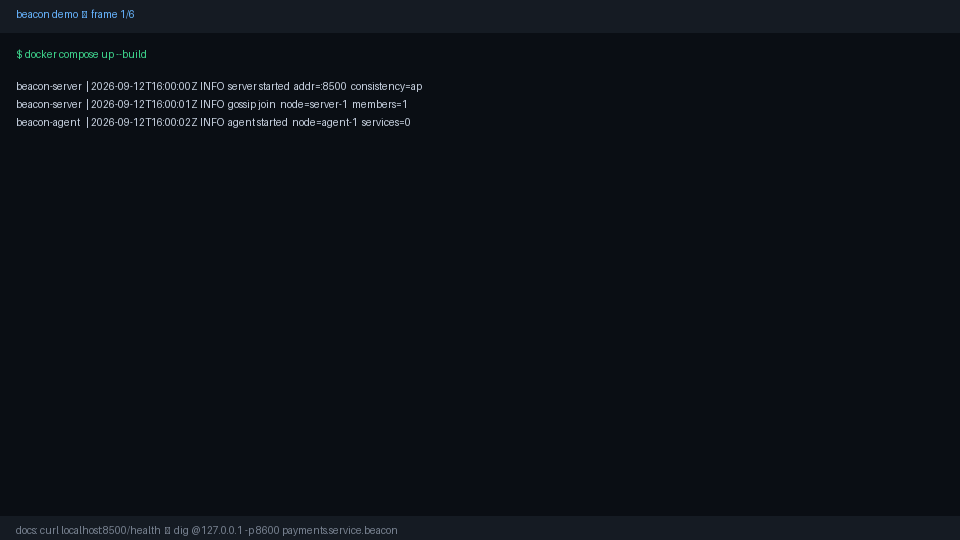
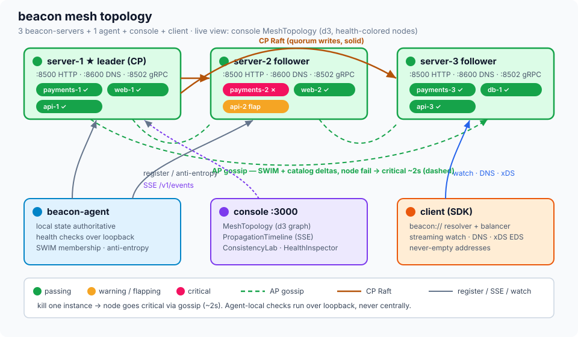
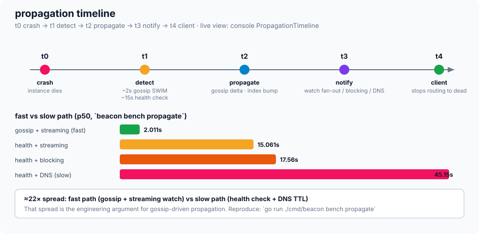
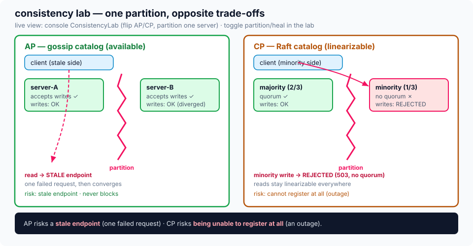

# Demo

Visual proof that beacon works end-to-end. The console is the visual playground
(same role as the Next.js playground in the Rate-Limiter project).



## Visual assets (checked in)

| Asset | Shows |
|---|---|
|  | 3 beacon-servers + agent + console + client; AP gossip (dashed) vs CP Raft (solid); health-colored nodes |
|  | t0 crash → t1 detect (~2s gossip) → t2 propagate → t3 notify → t4 client; fast (~2s) vs slow (~45s) bars |
|  | AP stale-read vs CP rejected-write under partition |

## 60-second run

```bash
docker compose up --build
# console  http://localhost:3000
# API      http://localhost:8500  (/health, /ready, /metrics, /v1/*)
# Grafana  http://localhost:3001  (if observability profile enabled)
./bin/beacon register --name payments --port 8080 --tag v2
./bin/beacon watch payments
go run ./cmd/beacon bench propagate
```

## What to capture

1. **Mesh topology** — register 3 services, kill one instance, watch the node go critical (~2s via gossip).
2. **Propagation timeline** — `bench propagate` output + console timeline (t0 crash → t4 client).
3. **Consistency lab** — flip AP/CP, partition one server, show stale-read vs rejected-write.

## Recording the GIF

```bash
# terminal session
asciinema rec demo.cast -c "docker compose up --build"
# or screen capture, then:
ffmpeg -i demo.mov -vf "fps=12,scale=960:-1:flags=lanczos" docs/assets/demo.gif
```

Drop the file at `docs/assets/demo.gif` and embed in `README.md`:

```md

```

Screenshots and diagrams go in `docs/assets/` as `topology.svg`, `timeline.svg`, and
`consistency-lab.svg` (rendered above). The checked-in GIF is captured from the running
browser console, not generated terminal artwork. Keep the capture at 1440×900 and downscale
to 960×600 so the console text remains legible in README and Pages.
